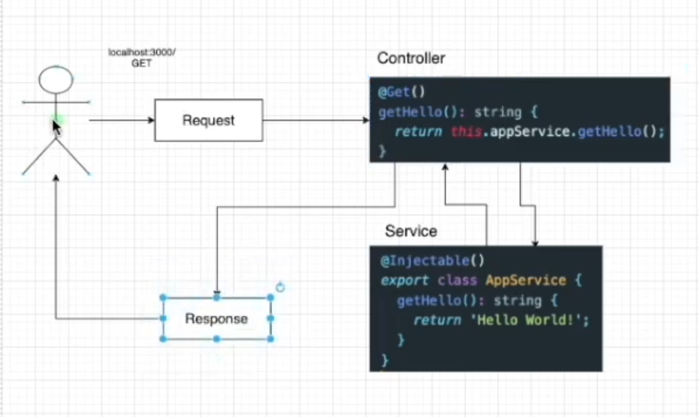

#  프로젝트 구조
- eslintrc.js : 타입스크립트 가이드라인 제시, 문법 등의 오류 알려주기 위한 파일
- prettierrc : 외적인 코드 형식을 맞추기 위한 코드 포맷터 역할을 하는 파일

npm run start:dev 로 시작

# 앱 구조

- App Module(root module)
  - BoardModule
  - AuthModule

- 모듈이란...

  @Module 데코레이터로 정의된 클래스

  각 기능을 담당하는 모듈 안에는 해당 기능과 관련된 controller, service, entity등이 존재함.

  모듈은 기본적으로 싱글톤이므로 여러 모듈간에 쉽게 공급자의 동일한 인스턴스를 공유할 수 있음.

  - `nest g module 모듈이름`으로 모듈 생성 가능

  ​	

- controller란...

  @Controller 데코레이터로 정의된 클래스

  - Handler로 구성
    - @Get(), @Put(), ... 데코레이터
  - `nest g controller 컨트롤러이름 --no-spec` 으로 생성 가능, no spec : 테스트위한 스펙파일 생성 x

- provider,service란...

  provider의 주요 아이디어는 <u>종속성으로 주입할 수 있다는 것</u>.! 컨트롤러에 필요하지만 한 코드에 모든 것을 적기는 힘드므로, 여러 서비스에서 기능을 가져올 것이다. 이때, 종속성을 주입한다고 말하며 서비스는 여기서 종속성을 제공하는 provider의 역할을 함을 알 수 있다.

  provider는 역시 module파일에 등록해야한다.

  - Service란.!

    @Injectable 데코레이터로 감싸져서 모듈에 제공되며, 다양한 컨트롤러에서 사용될 수 있다.!

    서비스는 컨트롤러에서 데이터의 유효성 체크를 하거나, 데이터베이스의 작업을 처리하는 등을 담당한다.

  서비스를 컨트롤러에서 사용하기 위해서는 컨트롤러에 dependency injection이 필요하다! constructor에다가 넣어주는 방법으로  서비스를 인젝션해줄수 있다.!

# CRUD

## R

### 모든 게시물 데이터를 데이터 베이스에서 가져오기

model이 필요하다.! 모델을 정의하기 위해서는 class나 interface를 이용하면 된다.! interface는 변수의 타입만을 체크하고, class는 거기에 인스턴스를  추가하는 기능까지 있다고 보면 된다. board.model.ts에다가 board interface를 작성하자.

## C

서비스에서 먼저 함수를 만들고, controller에 의존성을 주입하는 방법으로 코딩해보자.

controller에서 post의 body를 보려면 어떻게 해야할까? @Body() 데코레이터를 이용하면 된다! 그 중 일부 프로퍼티만 가져오려면 @Body('title') 로도 가져올 수도 있다.

## DTO (Data Transfet Object)

계층간 데이터 교환을 위한 객체. DB에서 데이터를 얻어 Service나 controller 로 보낼 때 사용하는 객체

데이터가 네트워크를 통해 전송되는 방법을 정의하는 객체

interface나 class로 구현가능하지만, nest에서는 후자를 추천(인터페이스와 다르게 런타임에서 작동하므로 파이프와 같은 기능을 이용할 때 유용)

### Why DTO?

데이터의 유효성을 체크하여 안정적인 코드로 만들어준다.

예를 들어, create에서 인자로 각 프로퍼티를 넘겨주면 프로퍼티 이름 등을 수정해야할 때, 일일이 바꿔줘야한다. 따라서, 인자를 DTO객체로 받아서 처리를 하면 유지보수를 간단하게 할 수 있다.

-> 모델과 DTO는 이러한 측면에서 다르다.! 모델은 하나의 객체로써 어플리케이션(혹은 서비스)에서 어떠한 역할을 하며, DTO는 데이터 전송 측면에서 인자로 넘겨지는 객체로 보면 편할 것 같다.

## D

컨트롤러에서 @Delete() 데코레이터를 이용한다.

url parameter를 가져오기 위하여 @Param() 데코레이터를 사용할 수 있다.

## U

patch() 데코레이터 이용

## Pipe

@Injectable() 데코레이터로 주석이 달린 클래스. DTO에다가 달아주기도 한다!

Data transformation, validation을 위해 사용됨. client request는 pipe를 거쳐 response를 응답받거나 에러를 받게 될 것이다.

파이프를 사용하는 것은(Binding Pipes)는 handler-level, parameter-level, global-level에서 이루어질 수 있다.

- Handler-level

  controller(handler) 레벨에서 @UsePipes() 데코레이터를 이용하여 해당 함수의 전체 파라미터를 위한 파이프로 사용할 수 있다.

- parameter-level

  함수의 한 파라미터를 파이프를 거치도록 구현할 수 있다.

- global-level

  클라이언트에 들어오는 모든 요청에 적용될 수 있도록하기 위해, main.ts에서 useGlobalPipes()함수로 설정해줄 수 있다.

Nest.js에서 제공되는 6가지 파이프가 있으며, 사용자 커스텀 파이프도 만들 수 있다.

class-validator, class-transformer 라이브러리로 파이프를 사용해보자!

-> DTO에다가 @IsNotEmpty()와 같은 데코레이터로 validation을 달아주고, handler-level에서 @UsePipes(ValidationPipe) 데코레이터를 달아주어 파이프를 유효성 검증에 사용할 수 있도록 구현할 수 있다.

### throw error

throw new NotFoundException(`Can't find Board with id ${id}`);와 같이 에러를 호출할 수 있다.

### Custom pipe 

PipeTransform이라는 인터페이스를 커스텀 파이프에서 구현해야함.! 그리고, 이 인터페이스에서는 transform을 구현해줘야한다.

- transform(value, metadata)

  여기서 유효성 검증을 해줄 수 있다.


# PostgreSQL 이용

데이터를 보관할 때 로컬 메모리에 저장하면, reloading 될때마다 지워지니까 저장소에 두고 해보도록 하자!

brew install postgresql & cask install pgadmin4

brew services start postgresql로 db server 시작

/opt/homebrew/Cellar/postgresql@14/14.5_4/bin 로 가서 createuser -s postgres 해주고, pgadmin에서 localhost로 생성하면 됨~

# TypeORM (Object Relation Mapping)

TypeORM이란, node.js에서 실행되는 객체 관계형 mapper library이다.

객체와 관계형 데이터베이스의 데이터를 자동으로 변형 및 연결하는 작업을 ORM이라고 해주며 이를 해주게 한다. 

OOP의 class와 RDB의 table을 연결해주는 것이라고 생각하면 편할 것이다. 그냥 js를 사용한다면, query를 사용하여 귀찮게 해줘야하는데, js코드로 간단하게 db CRUD를 지원하게 해줄 수 있게 해준다.

`npm install pg typeorm @nestjs/typeorm --save`로 nest에서 postgresql를 typeorm을 사용하기 위한 모듈 설치

```typescript
//typeorm 설정을 위한 파일 configs/typeorm.config.ts
import { TypeOrmModuleOptions } from '@nestjs/typeorm';
export const typeORMConfig: TypeOrmModuleOptions = {
  type: 'postgres',
  host: 'localhost',
  port: 5432,
  username: 'postgres',
  // password : '1308',
  database: 'board-app',
  entities: [__dirname + '/../**/*.entity.{js,ts}'],
  synchronize: true,
};

```

이렇게 하고, root module에서 import 해준다.

## Entity 생성하기

### Why Entity??

ORM 없이 데이터 베이스를 생성할 때는 `Create Table ~~ `와 같이 이용하여 생성하였다. 하지만 ORM을 이용하면 entity class를 만들어서 테이블에 연결되는 클래스를 정의할 수 있다. @Entity() 데코레이터와 @Column() 등의 데코레이터를 사용한다.

## Repository 생성하기

### What is Repository?

entity 객체와 함께 작동하며, entity CRUD를 처리한다. 

DB와 관련된 일들은 Service에서 하는 것이 아니라 Repository에서 수행하며, 이를 `Repository Pattern`이라고도 부른다.

- board.repository.ts를 생성

model과 entity의 차이는 ?? 이를 구별하기.! entity는 DB와 1:1매칭이 되는 Class! 따라서 entity에는 어떤 것이 column이고, pk이고 등의 정보가 들어가게 될 것이고, model은 데이터베이스를 사용한다면 굳이 필요가 없어질 것이다.! 

파일 정리를 한번 싹 해주자~

